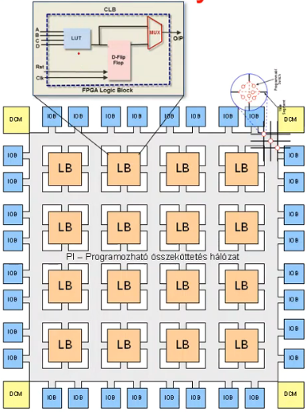

# ZH felkészülés

[Lejátszási lista az anyagról](https://youtube.com/playlist?list=PLzX3yfM61SuvPCgkLn-1jL2dFLnio1DPG)

Tartalomjegyzék:

- [ZH felkészülés](#zh-felkészülés)
  - [RISC vs CISC](#risc-vs-cisc)
  - [Pipe-line elv](#pipe-line-elv)
  - [Hamming-kódú hibajavítás](#hamming-kódú-hibajavítás)
  - [Lebegőpontos számok ábrázolása](#lebegőpontos-számok-ábrázolása)
    - [IEEE](#ieee)
    - [DEC](#dec)
    - [IBM](#ibm)
  - [Huzalozott vezérlő egységek](#huzalozott-vezérlő-egységek)
    - [Mealy-modell](#mealy-modell)
    - [Moore-modell](#moore-modell)
  - [FPGA-k felépítése](#fpga-k-felépítése)
  - [Műveleti áramkörök (todo)](#műveleti-áramkörök-todo)
  - [0-3 című gépek (todo)](#0-3-című-gépek-todo)
  - [RTL leírások (todo)](#rtl-leírások-todo)

## RISC vs CISC

[Kapcsolódó videó](https://youtu.be/YE8FORtUSqA)

RISC

- Reduced Instruction Set Computer
- Tökéletes 1 feladatfa, nincs fölösleges funkció
- Hatékonyan használja a pipe-line elvet
- Motorola 88000
- Berkeley
- ARM

CISC

- Complex Instruction Set Computer
- Több utasítás
- AMD és Intel x86-32/64 processzorai
- Motorola 68000

## Pipe-line elv

A Fetch-Decode-Execute eljárást egybevágva, gyorsan végzi.

| 1. fázis | 2. fázis | 3. fázis | 4. fázis |
| -------- | -------- | -------- | -------- |
| Fetch    | Decode   | Execute  | Fetch    |
|          | Fetch    | Decode   | Execute  |
|          |          | Fetch    | Decode   |

## Hamming-kódú hibajavítás

- [Kapcsolódó videó](https://youtu.be/J0noMJq_h8M)
- 3Blue1Brown
  - [1. rész](https://youtu.be/X8jsijhllIA)
  - [2. rész](https://youtu.be/b3NxrZOu_CE)

## Lebegőpontos számok ábrázolása

`[sign|exponent+exc|mantissa]`

### IEEE

- normalizálás: [1; 2]
- van rejtett bit
- mantissza hossza: 24
- excess: 127

### DEC

- normalizálás: [$^1/_2$; 1]
- mantissza hossza: 24
- excess: 128

### IBM

- normalizálás: [$^1/_{16}$; 1]
- 16-os számrendszer
- mantissza hossza: 24
- excess: 64

## Huzalozott vezérlő egységek

### Mealy-modell

- bemenettől közvetlen függ a kimenet
- leképzési szabályok
  - Következő állapot függvénye: $\delta(X_n, Y_n)→Y_n+1$
  - Kimeneti függvény: $\mu(X_n, Y_n)→Z_n$

```
[Combinational Logic] → [Output]
      ↑      ↓
  [State Register]
```

### Moore-modell

- bemenettől nem közvetlen függ, ugrásokon át kapjuk a kimenetet
- leképzési szabályok
  - Következő állapot függvénye: $\delta(X_n, Y_n)→Y_n+1$
  - Kimeneti függvény: $\mu(Y_n)→Z_n$

```
[Combinational Logic]
      ↑      ↓
  [State Register]
         ↓
      [Output]
```

## FPGA-k felépítése

Az <abbr title="Field Programmable Gate Array">FPGA</abbr> egy <abbr title="Programmable Logic Device">PLD</abbr> típus.



| Jelmagyarázat    |                                     |
| ---------------- | ----------------------------------- |
| LUT              | LookUp Table / kombinációs hálózat  |
| Szürke zóna      | programozható összeköttetés hálózat |
| LB               | logikai blokk / makrocella          |
| DCM              | digitális órajel meneddzser         |
| IOB              | csatlakozás külvilág fele           |
| **Extra elemek** |                                     |
| BRAM             | Blokk-RAM (~100KB-10MB)             |
| (MULT) DSP       | aritmetikai és logikai műveletvégző |
| Beágy. proc.     | egy terület kialakítható procinak   |


## Műveleti áramkörök (todo)

## 0-3 című gépek (todo)

## RTL leírások (todo)
