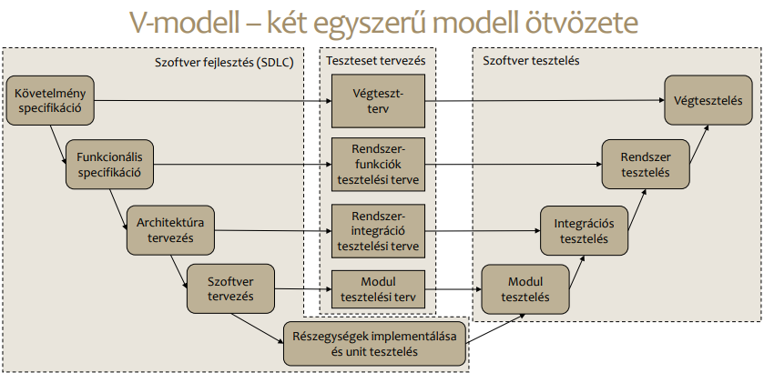

# 1. ZH kidolgozás emlékezetből

Üzemmérnök csoportban Tamás kolléga üzenete alapján.

## V modell

### Két ág közötti különbség

Az első ág a fejlesztés szakaszról szól, a második ág pedig a testelést írja le.

## Szekvencia diagram főbb elemei és ábrázolása

## Mi az az STLC?

## Követelmény elemzés / tervezést melyik diagramokra lehet használni
