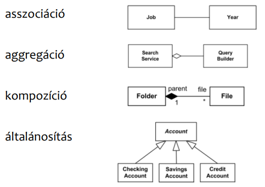
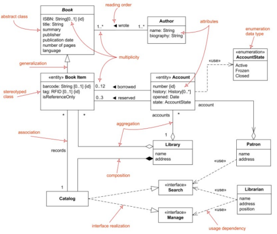

# Szoftvermodellezés

- [Szoftvermodellezés](#szoftvermodellezés)
  - [Bevezetés](#bevezetés)
    - [Szoftvergyártás általános lépései](#szoftvergyártás-általános-lépései)
    - [Szoftvergyártás modellek](#szoftvergyártás-modellek)
    - [Vízesés modell](#vízesés-modell)
    - [Szoftver ellenőrzés lépései](#szoftver-ellenőrzés-lépései)
    - [Egyszerű modell](#egyszerű-modell)
    - [V-modell](#v-modell)
  - [Szoftvermodellezés modellek](#szoftvermodellezés-modellek)
    - [Rendszerek bonyolultsága](#rendszerek-bonyolultsága)
    - [Modellek](#modellek)
    - [Modellezési nyelvek](#modellezési-nyelvek)
  - [UML](#uml)
    - [Diagrammok](#diagrammok)
      - [Osztály diagram](#osztály-diagram)
      - [Objektum diagram](#objektum-diagram)
      - [Csomag diagram](#csomag-diagram)
      - [Összetett struktúradiagram](#összetett-struktúradiagram)
      - [Komponens diagram](#komponens-diagram)
      - [Telepítési diagram](#telepítési-diagram)
      - [Profil diagram](#profil-diagram)
      - [Használati eset diagram](#használati-eset-diagram)
      - [Aktivitás diagram](#aktivitás-diagram)
      - [Állapotgép diagram](#állapotgép-diagram)
      - [Szekvencia diagram](#szekvencia-diagram)
      - [Kommunikációs diagram](#kommunikációs-diagram)
      - [Időzítési diagram](#időzítési-diagram)
      - [Interakciós áttekintő diagram](#interakciós-áttekintő-diagram)
    - [Diagramok használata](#diagramok-használata)

## Bevezetés

[PPT megnyitása](https://oktatas.mik.uni-pannon.hu/pluginfile.php/32701/mod_resource/content/1/I_Bevezetes.pdf)

> **Rendszer**
>
> Kapcsolódó komponensek halmaza, amelyek egy közös cél érdekében működnek együtt.

### Szoftvergyártás általános lépései

- 🗒️ Specifikáció
- 💻 Tervezés, fejlesztés
- ✅ V & V (tesztelés)
- 📈 Evolúció

### Szoftvergyártás modellek

- általános
  - [🌊 vízesés](#vízesés-modell)
  - 🐵 evolúciós (kísérletező, eldobható prototípus)
  - 🎲 komponens alapú
  - 📈 iteratív (inkrementális, spirális)
- speciális
  - extrém programozás
  - [V-modell](#v-modell)
  - Cleanroom
  - agilis
  - DevOps

### Vízesés modell

1. Specifikáció
2. Tervezés
3. Fejlesztés
4. [Ellenőrzés](#szoftver-ellenőrzés-lépései)
5. Evolúció

### Szoftver ellenőrzés lépései

- követelmény elemzés
- tesztterv készítés (hogyan kell tesztelni?)
- teszteset tervezés
- tesztkörnyezet felállítás
- teszt végrehajtása
- teszt ciklus lezárás

### Egyszerű modell

Megegyezik a [szoftver ellenőrzés lépései](#szoftver-ellenőrzés-lépései)vel.

### V-modell

A két egyszerű modell ötvözése.

---

## Szoftvermodellezés modellek

[PPT megnyitása (strukturális diagramokig)](https://oktatas.mik.uni-pannon.hu/pluginfile.php/32703/mod_resource/content/1/II_Szoftvermodellezes_1.pdf)

[PPT2 megnyitása (viselkedési diagramoktól)](https://oktatas.mik.uni-pannon.hu/pluginfile.php/33616/mod_resource/content/0/II_Szoftvermodellezes_2.pdf)

### Rendszerek bonyolultsága

📈 Exponenciálisan nő a rendszerek és szoftverek bonyolultsága.

### Modellek

- 🌍 Domén modell: környezetet írja le
- 🗒️ Specifikációs modell: szükséges szolgáltatásokkal foglalkozik
- 💻 Tervezési modell: a szoftvert, részeit és viselkedését írja le

### Modellezési nyelvek

- [UML](#uml)
- EXPRESS

## UML

Ábrák, névvel ellátott szimbólumok, grafikus jelölések.

### Diagrammok

- strukturális diagramok
  - [**osztály**](#osztály-diagram)
  - [**objektum**](#objektum-diagram)
  - [csomag](#csomag-diagram)
  - [összetett struktúra-](#összetett-struktúradiagram)
  - [komponens](#komponens-diagram)
  - [telepítési](#telepítési-diagram)
  - [profil](#profil-diagram)
- viselkedési diagramok
  - [**használati eset**](#használati-eset-diagram)
  - [**aktivitás**](#aktivitás-diagram)
  - [**állapotgép**](#állapotgép-diagram)
  - interakciós
    - [**szekvencia**](#szekvencia-diagram)
    - [kommunikációs](#kommunikációs-diagram)
    - [időzítési](#időzítési-diagram)
    - [interakciós áttekintő](#interakciós-áttekintő-diagram)

#### Osztály diagram

A tervezett (al)rendszer / komponens struktúráját mutatja.

Osztályok, interfészek és azok kapcsolatai.

#### Objektum diagram

#### Csomag diagram

#### Összetett struktúradiagram

#### Komponens diagram

#### Telepítési diagram

#### Profil diagram

#### Használati eset diagram

#### Aktivitás diagram

#### Állapotgép diagram

#### Szekvencia diagram

#### Kommunikációs diagram

#### Időzítési diagram

#### Interakciós áttekintő diagram

### Diagramok használata

- <abbr title="Rational Unified Process">RUP</abbr>
- egyéni tapasztalat
- vállalati gyakorlat
- **iparági ajánlások**
