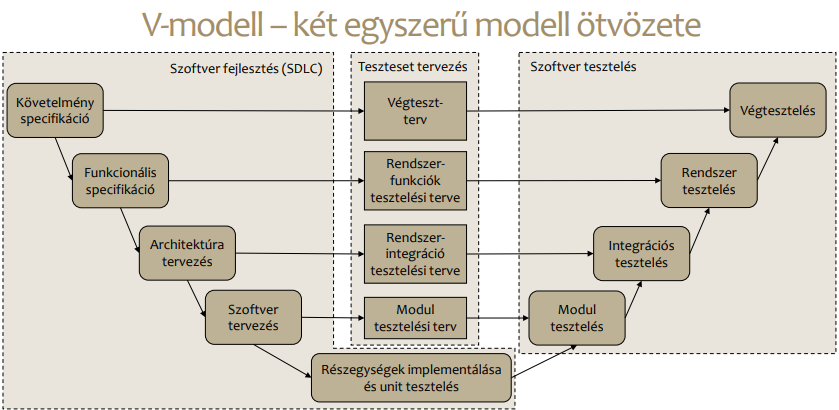

# Szoftvertesztelés

Tartalomjegyzék

- [Szoftvertesztelés](#szoftvertesztelés)
  - [Szoftvertesztelés alapjai](#szoftvertesztelés-alapjai)
    - [V-modell](#v-modell)
    - [V & V](#v--v)
      - [Statikus V & V](#statikus-v--v)
      - [Dinamikus V & V](#dinamikus-v--v)
    - [Szoftvertesztelés szintjei](#szoftvertesztelés-szintjei)
      - [Komponensteszt](#komponensteszt)
      - [Integrációs teszt](#integrációs-teszt)
      - [Rendszerteszt](#rendszerteszt)
      - [Átvételi teszt](#átvételi-teszt)
    - [A szoftvertesztelés technikái](#a-szoftvertesztelés-technikái)
    - [A szoftvertesztelés típusai](#a-szoftvertesztelés-típusai)
    - [Hibatesztelés vs. hibakeresés](#hibatesztelés-vs-hibakeresés)
  - [STLC](#stlc)
    - [Lépések](#lépések)
    - [Szoftvertesztelés folyamata](#szoftvertesztelés-folyamata)
    - [Követelmény elemzés](#követelmény-elemzés)
  - [Szoftteszt példa](#szoftteszt-példa)
  - [Struktúra alapú tesztelés](#struktúra-alapú-tesztelés)
  - [Specifikáció alapú tesztelés](#specifikáció-alapú-tesztelés)

## Szoftvertesztelés alapjai

[PPT](https://oktatas.mik.uni-pannon.hu/pluginfile.php/34746/mod_resource/content/1/04_Szoftverteszteles_alapjai.pdf)

### V-modell

### V & V

Verifikáció:
> Jó minőségű terméket fejlesztünk?
> Specifikációnak megfelel a szoftver?

Validáció:
> A megfelelő terméket fejlesztjük?
> Felhasználónak megfelel a szoftver?

Nem hibamentességet jelent, hanem azt, hogy el tudja-e látni a feladatát. A V & V-t a szoftver fejlesztés minden lépésénél alkalmazni kell.

#### Statikus V & V

Problémák feltárása a rendszer statikus reprezentációjának analízise segítségével.

#### Dinamikus V & V

Kísérletezés és a termék viselkedésének megfigyelése.

### Szoftvertesztelés szintjei

#### Komponensteszt

- Fejlesztők/tesztelők
- A teljes rendszer egy-egy komponensét teszteli önmagában
- Jellemzően white-box tesztelés

- Unit teszt
- Modul teszt
- Interfész tesztelés

#### Integrációs teszt

- Teszetelők
- Komponensek közötti együttműködést teszteli

#### Rendszerteszt

- Független tesztelő csoport
- A teljes rendszert, azaz minden komponenst együtt tesztel
- Jellemzően black-box teszt, a funkcionális követelmények alapján

#### Átvételi teszt

- Független tesztelő csoport + felhasználók
- Felhasználói teszt, a már kész rendszeren
- Ide tartoznak az alfa és béta tesztek

### A szoftvertesztelés technikái

- Fekete dobozos
- Fehér dobozos

### A szoftvertesztelés típusai

- Verifikációs tesztelés
- Validációs tesztelés

### Hibatesztelés vs. hibakeresés

- Hibatesztelés: programhibák jelenlétének feltárása
- Hibakeresés: hibák lokalizálása és javítása

## STLC

[PPT](https://oktatas.mik.uni-pannon.hu/pluginfile.php/34990/mod_resource/content/1/05_STLC.pdf)

### Lépések

### Szoftvertesztelés folyamata

### Követelmény elemzés

## Szoftteszt példa

[PPT](https://oktatas.mik.uni-pannon.hu/pluginfile.php/35242/mod_resource/content/1/08_Szoftverteszteles_pelda.pdf)

## Struktúra alapú tesztelés

[PPT](https://oktatas.mik.uni-pannon.hu/pluginfile.php/36086/mod_resource/content/1/Strukt%C3%BAra%20alap%C3%BA%20tesztel%C3%A9s.pdf)

## Specifikáció alapú tesztelés

[PPT](https://oktatas.mik.uni-pannon.hu/pluginfile.php/36087/mod_resource/content/1/Specifik%C3%A1ci%C3%B3%20alap%C3%BA%20tesztel%C3%A9s.pdf)
