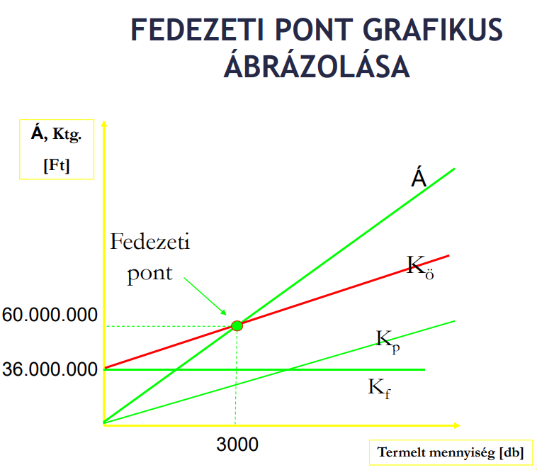

# Válgazd gyakorlat

- [Válgazd gyakorlat](#válgazd-gyakorlat)
  - [Önköltségszámítás](#önköltségszámítás)
  - [Fedezetszámítás](#fedezetszámítás)
    - [Fedezeti pont](#fedezeti-pont)
  - [Értékcsökkenés](#értékcsökkenés)
    - [Lineáris leírás](#lineáris-leírás)
    - [Évek száma összege módszer](#évek-száma-összege-módszer)
    - [Teljesítményarányos leírás](#teljesítményarányos-leírás)
  - [Munkaerő](#munkaerő)
    - [Levonások](#levonások)
    - [Családi kedvezmény](#családi-kedvezmény)
    - [A családi járulékkedvezmény](#a-családi-járulékkedvezmény)
  - [Erőforrás-felhasználás optimalizálás](#erőforrás-felhasználás-optimalizálás)
  - [Befektetése értékelése](#befektetése-értékelése)
    - [Statikus módszerek](#statikus-módszerek)
    - [Dinamikus módszerek](#dinamikus-módszerek)
  - [Jövedelmezőségi mutatók](#jövedelmezőségi-mutatók)
  - [Készletgazdálkodás](#készletgazdálkodás)
  - [Likviditási mutatók](#likviditási-mutatók)

## Önköltségszámítás

Csak össze kell adni mindent és arányokat kell számolni.

## Fedezetszámítás

### Fedezeti pont

Ahol a `költség = bevétel`

## Értékcsökkenés

### Lineáris leírás

A várható élettartam alatt minden évben azonos összegű elhasználódást számolunk el költségként. A leírási kulcs állandó.

### Évek száma összege módszer

Leírási kulcs: `használati idő fordított számsora / évek számának összege`

### Teljesítményarányos leírás

A leírás alapja az időszakra tervezett teljesítmény. Járművek és műszaki gépek esetében gyakori, ahol a teljesítmény jól mérhető.

## Munkaerő

`Teljesítmányfok = teékesített munkaóra / kötelező munkaóra`

`Létszámszükséglet = (volumen * normaóra) / (teljesítményfok * egy fő kötelező munkaórája)`

### Levonások

- SZJA: bruttó bér 15%-a
- TB járulék: 18.5%

### Családi kedvezmény

A családi kedvezményt érvényesítő magánszemély az összevont adóalapját a családi kedvezménnyel csökkenti.

A családi kedvezmény - az eltartottak lélekszámától függően - kedvezményezett eltartottanként és jogosultsági hónaponként

| Gyerekek | Kedvezmény |
| -------- | ---------- |
| 1        | 66670      |
| 2        | 133330     |
| 3+       | 220000     |

A családi kedvezmény érvényesítésére jogosult az a magánszemély, aki gyermekre tekintettel családi pótlékra jogosult, a várandós nő és a vele közös háztartásban élő házastársa.

A jogosult az őt megillető családi kedvezményt megoszthatja a vele közös háztartásban élő, jogosultnak nem minősülő házastársával.

### A családi járulékkedvezmény

A családi járulékkedvezmény összege a biztosítottat megillető családi kedvezmény összegéből ténylegesen érvényesített családi kedvezménnyel csökkentett összeg 15 százaléka, de legfeljebb a járulékok együttes összege.

## Erőforrás-felhasználás optimalizálás

## Befektetése értékelése

### Statikus módszerek

### Dinamikus módszerek

## Jövedelmezőségi mutatók

## Készletgazdálkodás

## Likviditási mutatók
